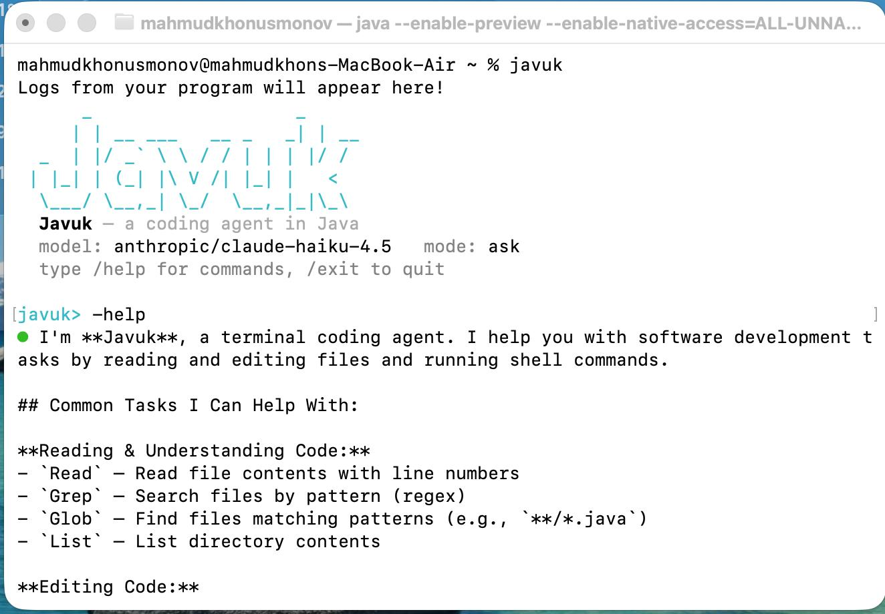

# Javuk

Javuk is a terminal-based coding agent implemented in Java. It accepts natural-language
development tasks, sends them to a configured language model, and can read files, edit
code, search a workspace, run shell commands, fetch web content, and delegate focused
tasks to subagents.

The project supports an interactive REPL and a non-interactive one-shot mode. It began
as an implementation of the CodeCrafters "Build your own Claude Code" challenge.



## Project Overview

Javuk runs an agent loop that streams model responses, executes requested tools, returns
tool results to the model, and continues until the model produces a final response.
Interactive sessions include permission controls for mutating tools, persistent sessions,
custom commands, project context files, hooks, and Model Context Protocol (MCP) tools.

For an implementation overview, see [docs/ARCHITECTURE.md](docs/ARCHITECTURE.md).

## Key Features

- Interactive REPL with command history, streamed output, slash commands, and cancellable turns
- One-shot prompt execution for scripts and CodeCrafters compatibility
- Eleven built-in tools: `Read`, `Write`, `Edit`, `MultiEdit`, `Bash`, `Glob`, `Grep`,
  `List`, `TodoWrite`, `WebFetch`, and `Task`
- Permission modes for interactive sessions: `ask`, `auto`, and `plan`
- Edit previews before interactive approval of mutating actions
- Parallel execution when all tool calls in a batch are read-only
- Workspace confinement and private-network fetch protection by default
- OpenRouter, OpenAI, Ollama, custom OpenAI-compatible endpoints, and native Anthropic support
- Native Anthropic tool use and prompt caching
- MCP server connections over stdio or HTTP/SSE
- Persistent sessions, token usage, and estimated cost reporting
- Pre-tool and post-tool shell hooks
- Project-specific commands from `.javuk/commands/*.md`
- Selectable agent personas — built-in and user-defined — with restricted tool sets
- Notification sounds for turn completion, permission prompts, and errors
- Automatic context loading from `JAVUK.md`, `AGENTS.md`, or `CLAUDE.md`

## Technology Stack

| Component | Technology |
|---|---|
| Language and runtime | Java 25 with preview features |
| Build system | Maven |
| Command-line parsing | picocli |
| Interactive terminal | JLine |
| Model providers | OpenAI Java SDK and Anthropic Java SDK |
| MCP integration | Official MCP Java SDK |
| JSON processing | Jackson |
| Testing | JUnit 5 |

## Installation

### Requirements

- JDK 25
- Maven 3
- An API key for a hosted provider, or a running local Ollama server

Clone and build the project:

```sh
git clone https://github.com/UsmanovMahmudkhan/codecrafters-claude-code-java.git
cd codecrafters-claude-code-java
mvn -B package
```

The build creates an executable jar at:

```text
target/codecrafters-claude-code.jar
```

Configure a provider before starting Javuk. OpenRouter is the default:

```sh
export OPENROUTER_API_KEY="your-api-key"
```

Other supported provider keys are `OPENAI_API_KEY` and `ANTHROPIC_API_KEY`. Ollama does
not require a real API key.

## Usage

Start the interactive REPL:

```sh
java --enable-preview --enable-native-access=ALL-UNNAMED \
  -jar target/codecrafters-claude-code.jar
```

Run a single prompt:

```sh
java --enable-preview --enable-native-access=ALL-UNNAMED \
  -jar target/codecrafters-claude-code.jar \
  -p "Review the source code and summarize the main packages."
```

One-shot mode is non-interactive and automatically permits requested tool actions. Use it
only in a workspace where those actions are acceptable.

### Command-Line Options

```text
-p <prompt>                  Run one prompt non-interactively
--model <id>                 Select a model
--provider <name>            Select openrouter, openai, ollama, or anthropic
--base-url <url>             Use a custom OpenAI-compatible endpoint
--yolo                       Automatically approve tool actions
--readonly, --plan           Block mutating tools
--resume [id]                Resume a saved session, or the most recent session
--allow-private-fetch        Allow WebFetch to access private or internal hosts
--allow-outside-workspace    Allow file and search tools outside the working directory
--no-sound                   Disable REPL notification sounds
-h, --help                   Show command help
```

### Interactive Commands

| Command | Purpose |
|---|---|
| `/help` | Show interactive commands |
| `/model [id]` | Show or change the current model |
| `/models` | List models with known pricing |
| `/tools` | List available tools |
| `/permissions [mode]` | Show or set `ask`, `auto`, or `plan` mode |
| `/allow <Tool>[: prefix]` | Persistently allow matching actions |
| `/allowed` | List persisted allow rules |
| `/save [id]`, `/load <id>`, `/sessions` | Manage sessions |
| `/compact` | Replace conversation history with a generated summary |
| `/commands` | List project-specific commands |
| `/agents [name]` | List agent personas, or switch to one (`/agents default` to reset) |
| `/sound [on\|off]` | Show or toggle notification sounds |
| `/cost`, `/tokens` | Show usage information |
| `/clear` | Clear the current conversation |
| `/exit` | Exit the REPL |

Use `@path/to/file` in a prompt to include a readable file as context. Press `Ctrl-C`
during a running turn to cancel that turn.

## Project Structure

```text
src/main/java/Main.java              Application entry point
src/main/java/dev/javuk/agent/       Agent loop, conversations, and subagents
src/main/java/dev/javuk/cli/         CLI, REPL, slash commands, and file mentions
src/main/java/dev/javuk/config/      Configuration loading and runtime settings
src/main/java/dev/javuk/hooks/       Pre-tool and post-tool hooks
src/main/java/dev/javuk/llm/         Provider clients, models, and usage tracking
src/main/java/dev/javuk/mcp/         MCP connections and tool adapters
src/main/java/dev/javuk/permission/  Permission modes and persistent allowlist
src/main/java/dev/javuk/session/     Session persistence
src/main/java/dev/javuk/tools/       Built-in tool implementations and registry
src/main/java/dev/javuk/ui/          Terminal rendering
src/test/java/                       JUnit test suite
docs/ARCHITECTURE.md                 Architecture documentation
```

## Configuration

Configuration precedence is:

```text
defaults < user config < project config < environment variables < CLI options
```

Javuk reads user configuration from `~/.config/javuk/config.json` and project
configuration from `./.javuk/config.json`.

```json
{
  "provider": "anthropic",
  "model": "claude-sonnet-4-6",
  "permissionMode": "ask",
  "webFetch": {
    "allowPrivateHosts": false
  },
  "workspace": {
    "allowOutside": false
  },
  "sound": true,
  "hooks": {
    "preTool": [],
    "postTool": []
  },
  "mcpServers": {
    "filesystem": {
      "command": "npx",
      "args": ["-y", "@modelcontextprotocol/server-filesystem", "."]
    },
    "remote": {
      "url": "https://example.com/mcp"
    }
  }
}
```

Supported environment variables:

| Variable | Purpose |
|---|---|
| `OPENROUTER_API_KEY` | OpenRouter API key |
| `OPENAI_API_KEY` | OpenAI API key |
| `ANTHROPIC_API_KEY` | Anthropic API key |
| `OPENROUTER_BASE_URL` | OpenAI-compatible base URL |
| `JAVUK_MODEL` | Default model identifier |
| `JAVUK_PROVIDER` | Provider name |
| `JAVUK_PERMISSION_MODE` | Interactive permission mode |
| `JAVUK_DEBUG` | Enable file logging at `~/.config/javuk/javuk.log` |

By default, file and search tools cannot access paths outside the working directory, and
`WebFetch` rejects private, loopback, link-local, and non-HTTP targets. The related CLI
options and configuration fields explicitly disable these protections.

Mutating actions in interactive mode pass through the selected permission mode. Persistent
allow rules are stored at `~/.config/javuk/allowlist.json`, and sessions are stored under
`~/.config/javuk/sessions/`.

Pre-tool hooks can block an action by returning a non-zero exit code. Hook commands receive
the tool name and arguments through `JAVUK_TOOL` and `JAVUK_TOOL_ARGS`. Tools discovered
from MCP servers are registered with names in the form `server__tool`.

## Examples

Use OpenAI:

```sh
export OPENAI_API_KEY="your-api-key"
java --enable-preview --enable-native-access=ALL-UNNAMED \
  -jar target/codecrafters-claude-code.jar \
  --provider openai --model gpt-4o-mini
```

Use native Anthropic:

```sh
export ANTHROPIC_API_KEY="your-api-key"
java --enable-preview --enable-native-access=ALL-UNNAMED \
  -jar target/codecrafters-claude-code.jar \
  --provider anthropic --model claude-sonnet-4-6
```

Use a local Ollama model:

```sh
java --enable-preview --enable-native-access=ALL-UNNAMED \
  -jar target/codecrafters-claude-code.jar \
  --provider ollama --model qwen2.5-coder
```

Create a project command by adding `.javuk/commands/review.md`:

```md
Review `$ARGUMENTS` for correctness issues and report findings with line references.
```

Run it in the REPL:

```text
/review src/main/java/Main.java
```

## Agents

Agents are reusable personas: a system prompt, an optional restricted tool set, and an
optional model override. Javuk ships four built-ins — `code-reviewer`, `planner`,
`test-writer`, and `explorer` — and you can add your own.

Switch the active session to an agent (this resets the conversation):

```text
/agents              # list agents, highlighting the active one
/agents explorer     # switch to the read-only explorer persona
/agents default      # return to the standard Javuk agent
```

The model can also delegate to an agent through the `Task` tool by passing a
`subagent_type`, and the sub-agent runs with only that agent's tools.

Define your own agent at `~/.config/javuk/agents/<name>.md` (user-global) or
`.javuk/agents/<name>.md` (project, which overrides a built-in of the same name):

```md
---
name: doc-writer
description: Writes and improves documentation
tools: Read, Grep, Glob, Edit, Write
model: anthropic/claude-sonnet-4-6
---
You write clear, concise documentation. Read the code first, then update the docs.
```

All frontmatter keys are optional: `name` defaults to the file name, omit `tools` to grant
the full tool set, and omit `model` to use the session model. The text after the
frontmatter is the agent's system prompt.

## Development

Build the project and assemble the executable jar:

```sh
mvn -B package
```

Run the CodeCrafters-compatible wrapper:

```sh
./your_program.sh -p "Summarize the current project."
```

When adding a built-in tool, implement `dev.javuk.tools.Tool`, register it in
`Tools.defaultRegistry()`, mark mutating behavior correctly, and add focused tests.

## Testing

Run the test suite:

```sh
mvn -B test
```

The current suite contains 58 JUnit tests. CI runs `mvn -B package` for pushes and pull
requests targeting `main` or `master`.

## Contributing

Contributions should be focused, include tests for behavior changes, and preserve the
non-interactive `-p` contract. Run `mvn -B test` before opening a pull request.

See [CONTRIBUTING.md](CONTRIBUTING.md) for project-specific guidance.

## License

Javuk is available under the [MIT License](LICENSE).
