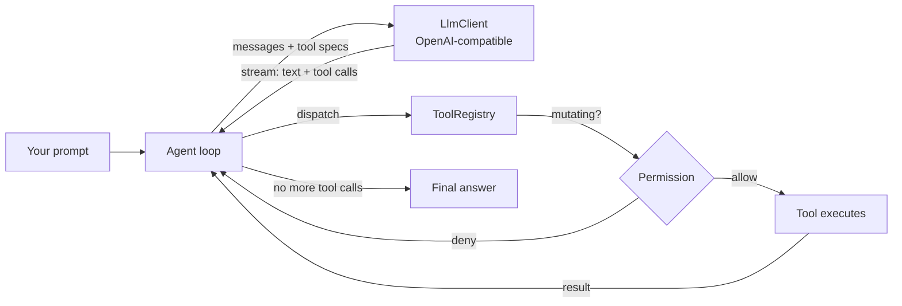

<div align="center">

# ⚡ Javuk

**A terminal coding agent, built from scratch in Java.**

Javuk is an LLM-powered coding assistant for your terminal — it reads and edits
your files, runs commands, and works through multi-step tasks using tool calls,
with live streaming output and a permission system that keeps you in control.

[](https://github.com/UsmanovMahmudkhan/codecrafters-claude-code-java/actions/workflows/ci.yml)
[](https://openjdk.org/projects/jdk/25/)
[](LICENSE)
[](https://app.codecrafters.io/users/UsmanovMahmudkhan?r=2qF)

</div>

```
  _                   _
 | | __ ___   __ _   _| | __
 | |/ _` \ \ / / | | | |/ /     javuk> refactor the parser and run the tests
 | | (_| |\ V /| |_| |   <      ● Reading src/Parser.java …
 |_|\__,_| \_/  \__,_|_|\_\     ⚙ Edit Parser.java   ⚙ Bash mvn -q test  ✓ 31 passing
```

> Started as the [CodeCrafters "Build your own Claude Code"](https://codecrafters.io/challenges/claude-code)
> challenge and grew into a full, tested agent platform.

---

## Features

- 🔁 **Agentic loop** — the model plans, calls tools, reads the results, and keeps going until the task is done.
- 🌊 **Live streaming** — responses stream token-by-token; tool calls are accumulated and executed as they arrive.
- 🧰 **11 built-in tools** — Read, Write, Edit, MultiEdit, Bash, Glob, Grep, List, TodoWrite, WebFetch, and **Task**.
- 🧬 **Subagents** — the `Task` tool delegates focused subtasks to nested agents with their own context.
- 🔌 **MCP support** — connect [Model Context Protocol](https://modelcontextprotocol.io) servers and use their tools alongside the built-ins.
- ⚡ **Parallel tools** — independent read-only tool calls in one turn run concurrently (virtual threads).
- 🔍 **Diff previews** — file edits show a coloured diff in the permission prompt before they apply.
- 🛡️ **Permissions + allowlist** — `ask` / `auto` (`--yolo`) / `plan`, plus persistent `/allow` patterns.
- 🪝 **Hooks** — run shell commands before/after every tool; a failing pre-hook blocks the call.
- 💬 **Interactive REPL** — JLine history & editing, slash commands, `@file` mentions, and **Ctrl-C cancels a running turn**.
- 🧩 **Custom commands** — drop `.javuk/commands/*.md` prompt templates and call them as `/name`.
- 🧠 **Project context** — automatically loads `JAVUK.md` / `AGENTS.md` / `CLAUDE.md` into the system prompt.
- 💾 **Sessions** — save, list, resume transcripts; `/compact` summarizes to free up context.
- 🌐 **Multi-provider** — OpenRouter (default), OpenAI, or a local Ollama server — anything OpenAI-compatible.
- 💵 **Cost & token tracking** — live usage and an estimated session cost.
- ✅ **Tested** — 41 JUnit tests; CI builds on every push.

## Quickstart

**Requirements:** JDK 25 and Maven.

```sh
# 1. Get an API key (OpenRouter shown; OpenAI / Ollama also supported)
export OPENROUTER_API_KEY="sk-or-..."

# 2. Build
mvn -B package

# 3. Run the interactive REPL
java --enable-preview -jar target/codecrafters-claude-code.jar

# …or one-shot
java --enable-preview -jar target/codecrafters-claude-code.jar -p "create a hello.txt with a greeting"
```

## Usage

```
javuk [options]

  -p <prompt>           Run a single prompt and print the answer (non-interactive)
  --model <id>          Model id, e.g. anthropic/claude-haiku-4.5
  --provider <name>     openrouter (default) | openai | ollama
  --base-url <url>      Custom OpenAI-compatible endpoint (overrides --provider)
  --yolo                Auto-approve all tool actions
  --readonly, --plan    Block all mutating tools
  --resume [id]         Resume a saved session (most recent if no id)
  -h, --help            Show help
```

### REPL slash commands

| Command | Description |
|---|---|
| `/help` | Show all commands |
| `/model [id]` | Show or switch the model |
| `/models` | List models with known pricing |
| `/tools` | List available tools |
| `/permissions [mode]` | Show or set permission mode (`ask`/`auto`/`plan`) |
| `/allow <pattern>` · `/allowed` | Always-allow patterns (persisted) |
| `/save [id]` · `/load <id>` · `/sessions` | Manage saved sessions |
| `/compact` | Summarize the conversation to free up context |
| `/commands` | List custom commands from `.javuk/commands/` |
| `/cost` · `/tokens` | Usage and estimated cost |
| `/clear` | Clear the conversation (keeps system prompt) |
| `/exit` | Quit |

Type `@path/to/file` in any prompt to inline that file's contents. Press
**Ctrl-C** during a response to cancel just that turn.

## Tools

| Tool | What it does |
|---|---|
| **Read** | Read a file with line numbers (supports `offset`/`limit`) |
| **Write** | Create/overwrite a file (creates parent dirs) |
| **Edit** | Exact-string replace with a uniqueness guard |
| **MultiEdit** | Apply several edits to one file, all-or-nothing |
| **Bash** | Run a shell command (timeout + output cap) |
| **Glob** | Find files by glob pattern |
| **Grep** | Search file contents by regex |
| **List** | List a directory |
| **TodoWrite** | Track a multi-step task list |
| **WebFetch** | Fetch a URL as plain text |
| **Task** | Delegate a subtask to a nested sub-agent |

Plus any tools exposed by connected **MCP servers** (namespaced `server__tool`).

## Configuration

Precedence: **defaults < config file < environment < CLI flags**.

Config file (`~/.config/javuk/config.json` or project `./.javuk/config.json`):

```json
{
  "model": "anthropic/claude-sonnet-4.6",
  "permissionMode": "ask",
  "hooks": {
    "preTool": ["echo \"$JAVUK_TOOL\" >> ~/.javuk-audit.log"],
    "postTool": []
  },
  "mcpServers": {
    "filesystem": { "command": "npx", "args": ["-y", "@modelcontextprotocol/server-filesystem", "."] }
  }
}
```

- **hooks** — `preTool` commands run before each tool (a non-zero exit blocks it);
  `postTool` run after. The tool name and JSON args are in `$JAVUK_TOOL` / `$JAVUK_TOOL_ARGS`.
- **mcpServers** — launched on REPL start; their tools appear as `server__tool`.
- **Custom commands** — Markdown files in `.javuk/commands/` become `/name`; `$ARGUMENTS` is substituted.

Environment: `OPENROUTER_API_KEY` / `OPENAI_API_KEY`, `OPENROUTER_BASE_URL`,
`JAVUK_MODEL`, `JAVUK_PERMISSION_MODE`, `JAVUK_DEBUG` (writes `~/.config/javuk/javuk.log`).

## How it works



The [`Agent`](src/main/java/dev/javuk/agent/Agent.java) asks the model, runs any
tools it requests through the [`ToolRegistry`](src/main/java/dev/javuk/tools/ToolRegistry.java)
(checking [permissions](src/main/java/dev/javuk/permission/) for mutating actions),
appends the results to the [`Conversation`](src/main/java/dev/javuk/agent/Conversation.java),
and repeats until the model returns a final answer. See [docs/ARCHITECTURE.md](docs/ARCHITECTURE.md).

## Development

```sh
mvn -B package             # compile, test, and assemble the fat jar
mvn -B test                # run the 41-test suite
./your_program.sh -p "…"   # run via the CodeCrafters wrapper
```

> Java 25 preview features are enabled; run with `--enable-preview`.

## Roadmap

- [x] Subagents (`Task`) and parallel tool execution
- [x] MCP (Model Context Protocol) tool support
- [x] Diff preview before applying edits
- [x] Hooks, custom commands, `@file` mentions, cancellable turns
- [ ] Native Anthropic provider (in addition to OpenAI-compatible)
- [ ] Streaming MCP transports (HTTP/SSE) in addition to stdio
- [ ] Auto-compaction when the context window fills

## Acknowledgements

Built on the [CodeCrafters](https://codecrafters.io) "Build your own Claude Code"
challenge and the [openai-java](https://github.com/openai/openai-java) SDK. Inspired
by [Claude Code](https://claude.com/claude-code).

## License

[MIT](LICENSE) © Usmonov Mahmudkhon
