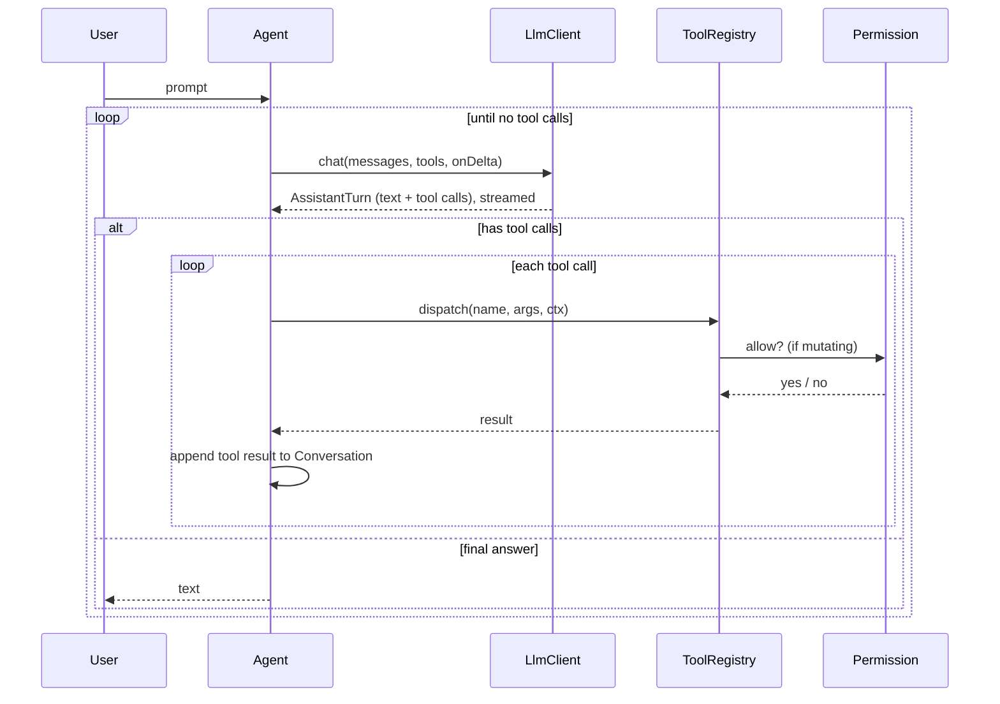

# Architecture

Javuk is organised into small, single-responsibility packages under
`dev.javuk`. `Main` is a thin shim in the default package (required by the
CodeCrafters jar manifest) that delegates to `cli.JavukCli`.

## Packages

| Package | Responsibility |
|---|---|
| `cli` | Entry point, argument parsing (picocli), the JLine REPL, slash commands |
| `agent` | The agent loop, conversation/transcript state, system prompt, subagents, agent personas |
| `llm` | Provider-agnostic chat client, streaming, model catalog, usage/cost |
| `tools` | The `Tool` interface, registry/dispatch, and the 10 built-in tools |
| `permission` | Permission modes, the interactive gate, and the persistent allowlist |
| `config` | Effective config and its loader (defaults < file < env < flags) |
| `session` | Persisted sessions (save / load / list / resume) |
| `mcp` | MCP client (stdio JSON-RPC), tool adapter, and connection manager |
| `hooks` | User-defined pre/post-tool shell hooks |
| `ui` | ANSI styling, banner, spinner, markdown, diff rendering |
| `util` | Shared JSON helpers and file logging |

## The agent loop

## Key seams

- **`LlmClient`** decouples the loop from the SDK. `AssistantTurn` is the
  provider-neutral result (text + tool calls), so streaming and non-streaming
  paths return the same shape and a new provider only needs one class.
- **`Tool`** advertises a JSON-schema and an `execute` method; `ToolRegistry`
  turns each tool into an OpenAI function spec and dispatches calls, enforcing
  permissions for mutating tools. Adding a tool = one class + one `register(...)`.
- **`Conversation`** keeps two parallel views: the SDK request params and a
  serialisable `Entry` transcript used for session save/resume.
- **`PermissionService`** is a single gate (`allow(tool, mutating, description)`)
  with `allowAll`, `readOnly`, and an interactive implementation.

## Streaming & tool-call assembly

`OpenAiCompatClient` uses the SDK's `createStreaming`. Text deltas are forwarded
to the UI immediately; tool-call deltas are accumulated by `index` (id, name,
and partial argument JSON are concatenated) and assembled into `AssistantTurn`
once the stream completes. Token usage is read from the final chunk.

## Advanced capabilities

- **Subagents** — the `Task` tool runs a nested `Agent` (`SubAgent`) sharing the
  parent's LLM client and tool context but with a clean conversation and no
  `Task` tool of its own, so delegation can't recurse without bound.
- **Agent personas** — `AgentRegistry` loads `AgentDefinition`s (markdown +
  frontmatter) from built-in resources, the user dir, and the project's
  `.javuk/agents/`, later sources overriding earlier by name. A persona carries a
  system prompt, an optional `ToolRegistry.subset(...)` of allowed tools, and an
  optional model. `/agents <name>` applies one to the main session; `Task`'s
  `subagent_type` applies one to a sub-agent. Restriction is enforced by simply not
  registering the tools the persona doesn't list.
- **Parallel tools** — when a turn's tool calls are all read-only, the loop runs
  them on virtual threads and collects results in order; any mutating batch stays
  serial so permission prompts never overlap.
- **Diff previews** — mutating tools implement `preview(args, ctx)`; the registry
  shows it (a coloured diff for edits) in the permission prompt before approval.
- **MCP** — `McpClient` speaks JSON-RPC over a server's stdio; discovered tools
  are wrapped as `McpTool` and registered like any built-in.
- **Hooks** — `ToolRegistry` runs configured pre/post-tool commands around each
  call; a non-zero pre-hook turns into a denial the model sees.

## CodeCrafters compatibility

The `-p <prompt>` path runs a single non-interactive turn and prints the final
answer to stdout — the original challenge contract. The interactive REPL, system
prompt, and everything else are additive and never touch that path.
